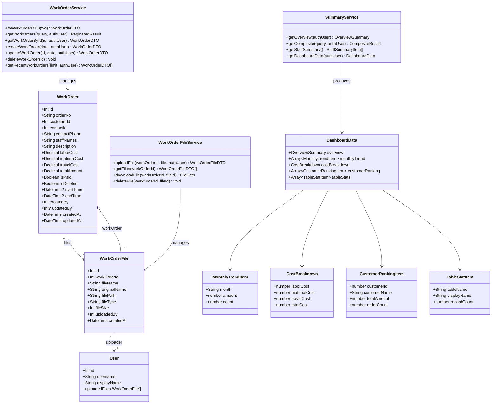
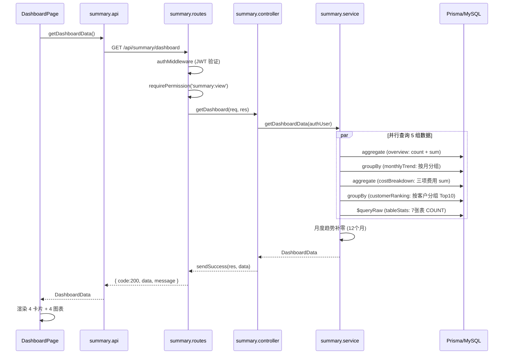
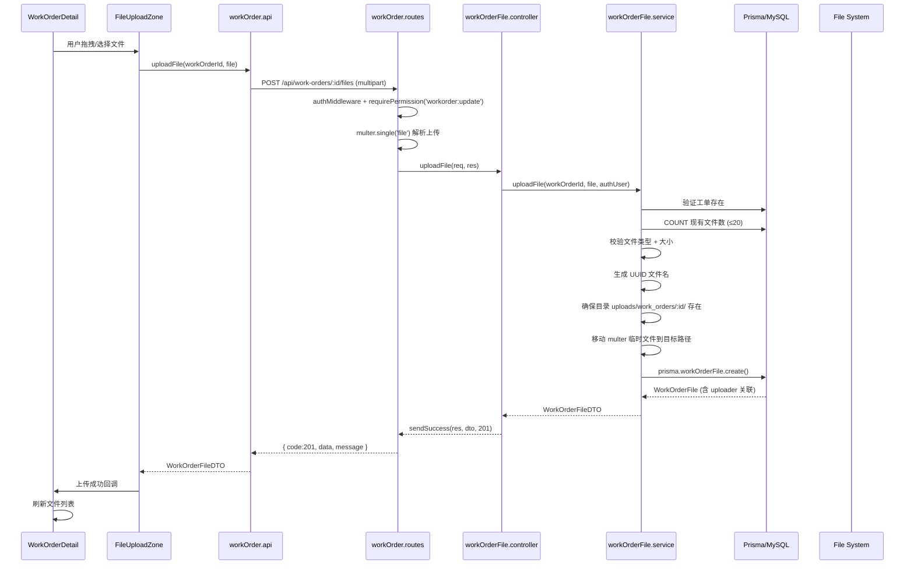
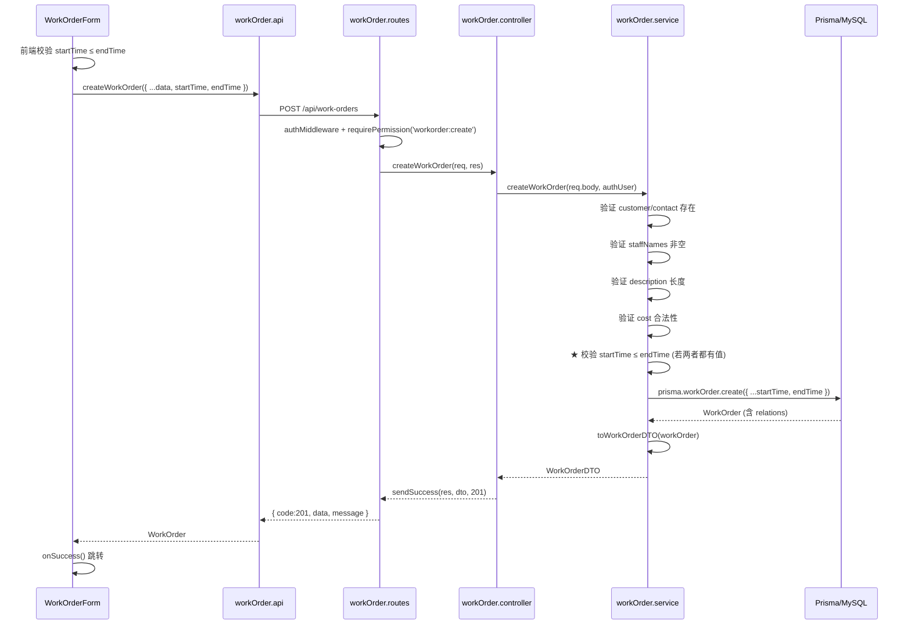
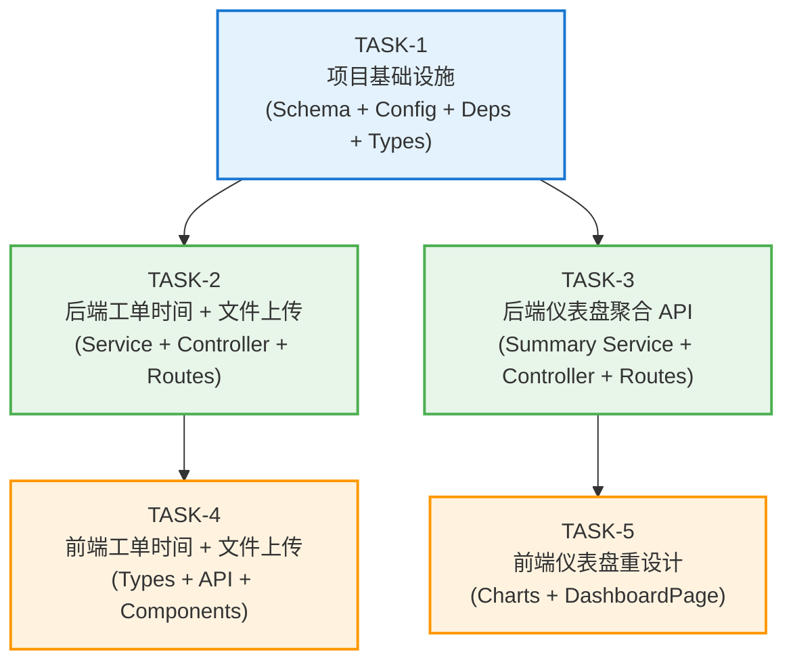

# 售后服务工单管理系统 — 增量架构设计与任务分解 (v2)

> **版本**: v2.0
> **日期**: 2025-07-14
> **作者**: 高见远（架构师）
> **基线**: v1.0 现有代码库
> **增量PRD**: `docs/PRD-增量-v2.md`

---

## 目录

1. [实现方案](#1-实现方案)
2. [完整文件列表](#2-完整文件列表)
3. [数据库变更](#3-数据库变更)
4. [API 设计](#4-api-设计)
5. [数据结构与接口](#5-数据结构与接口)
6. [程序调用流程](#6-程序调用流程)
7. [任务列表](#7-任务列表)
8. [依赖包列表](#8-依赖包列表)
9. [共享知识](#9-共享知识)
10. [任务依赖图](#10-任务依赖图)
11. [待明确事项](#11-待明确事项)

---

## 1. 实现方案

### 1.1 技术挑战分析

| 挑战 | 说明 | 方案 |
|------|------|------|
| 仪表盘聚合查询性能 | `GET /api/summary/dashboard` 需一次返回 5 类聚合数据（概览、月度趋势、费用构成、客户排行、表状态），涉及多次 Prisma aggregate / groupBy / raw query | 后端 `Promise.all` 并行执行 5 组查询，单次请求返回全部数据，避免前端多次请求 |
| 月度趋势补零 | 近 12 个月中部分月份可能无工单，需要返回 amount=0 的占位数据 | 后端生成 12 个月的月份数组，用 Map 匹配查询结果填充，无数据月份返回 0 |
| 数据库表状态统计 | 需要查询 7 张表的 COUNT(*)，包括软删除过滤 | 使用 Prisma `$queryRaw` 批量执行 COUNT 查询，工单表额外加 `WHERE is_deleted = false` |
| 文件上传安全 | 需限制文件类型、大小，生成唯一文件名，按工单分目录存储 | multer 中间件 + MIME 类型白名单 + UUID 文件名 + 按工单 ID 分目录 |
| 文件下载鉴权 | 静态文件服务无法经过 JWT 鉴权 | 使用专用下载 API `GET /api/work-orders/:id/files/:fileId/download`，经 authMiddleware 鉴权后 `res.download()` 流式返回 |
| 开始/结束时间校验 | 需确保 `startTime <= endTime`，且字段可选 | 后端 service 层在 create/update 时校验，两字段都有值才比较；前端提交前也做前端校验 |

### 1.2 技术选型确认

| 依赖 | 版本 | 用途 | 安装位置 |
|------|------|------|----------|
| `recharts` | `^2.12.0` | 仪表盘图表（柱状图、环形图、横向条形图） | client |
| `multer` | `^1.4.5-lts.1` | 文件上传中间件（multipart/form-data 解析） | server |
| `@types/multer` | `^1.4.11` | Multer TypeScript 类型定义 | server (devDependencies) |
| `uuid` | `^9.0.1` | 生成唯一文件名（UUID v4 + 原始扩展名） | server |
| `@types/uuid` | `^9.0.8` | UUID TypeScript 类型定义 | server (devDependencies) |

### 1.3 架构变更说明

**后端**：保持现有分层架构（routes → controllers → services → prisma），无架构模式变更。

- 新增 `WorkOrderFile` model 及对应的 service / controller / routes
- `summary.service.ts` 新增 `getDashboardData()` 聚合方法
- `workOrder.service.ts` 的 `toWorkOrderDTO()` / `CreateWorkOrderInput` / `UpdateWorkOrderInput` 扩展时间字段
- `config/index.ts` 新增 `upload` 配置段
- `app.ts` 新增 uploads 目录静态文件服务（仅用于图片缩略图预览，下载走专用 API）

**前端**：保持现有 React + MUI 架构，无架构模式变更。

- 新增 `dashboard/` 组件目录（4 个图表组件）
- 新增 `FileUploadZone` / `FileList` / `FilePreviewDialog` 文件上传相关组件
- `DashboardPage.tsx` 完全重写
- `StatCard.tsx` 扩展支持 `subValue` 副数值显示
- `WorkOrderForm.tsx` / `WorkOrderTable.tsx` / `WorkOrderDetail.tsx` / `WorkOrderMobileList.tsx` 扩展时间字段

---

## 2. 完整文件列表

### 2.1 后端（server）

| # | 文件路径 | 操作 | 变更说明 |
|---|----------|------|----------|
| 1 | `prisma/schema.prisma` | 修改 | WorkOrder 新增 `startTime` / `endTime`；新增 `WorkOrderFile` model；User 新增 `uploadedFiles` 反向关联 |
| 2 | `src/config/index.ts` | 修改 | 新增 `upload` 配置段（dir, maxFileSize, allowedTypes） |
| 3 | `src/types/index.ts` | 修改 | `WorkOrderDTO` 新增 `startTime` / `endTime`；新增 `WorkOrderFileDTO` / `DashboardData` 接口 |
| 4 | `src/app.ts` | 修改 | 新增 uploads 静态文件服务 `app.use('/uploads', express.static(...))` |
| 5 | `src/services/workOrder.service.ts` | 修改 | `toWorkOrderDTO` 映射时间字段；`CreateWorkOrderInput` / `UpdateWorkOrderInput` 新增时间字段；create/update 校验 start ≤ end |
| 6 | `src/services/workOrderFile.service.ts` | **新增** | 文件上传/列表/下载/删除业务逻辑 |
| 7 | `src/controllers/workOrderFile.controller.ts` | **新增** | 文件相关控制器（4 个端点） |
| 8 | `src/routes/workOrder.routes.ts` | 修改 | 新增文件子路由（POST/GET/DELETE files，GET download） |
| 9 | `src/services/summary.service.ts` | 修改 | 新增 `getDashboardData()` 聚合方法 |
| 10 | `src/controllers/summary.controller.ts` | 修改 | 新增 `getDashboard` 控制器方法 |
| 11 | `src/routes/summary.routes.ts` | 修改 | 新增 `GET /dashboard` 路由 |
| 12 | `package.json` | 修改 | 新增 multer / uuid 及其 @types 依赖 |

### 2.2 前端（client）

| # | 文件路径 | 操作 | 变更说明 |
|---|----------|------|----------|
| 13 | `src/types/index.ts` | 修改 | `WorkOrder` 新增 `startTime` / `endTime`；新增 `WorkOrderFile` / `DashboardData` 等接口 |
| 14 | `src/api/workOrder.api.ts` | 修改 | `CreateWorkOrderRequest` 新增时间字段；新增文件上传/列表/下载/删除 API 函数 |
| 15 | `src/api/summary.api.ts` | 修改 | 新增 `getDashboardData()` 函数 |
| 16 | `src/utils/format.ts` | 修改 | 新增 `formatDuration()` 时长计算函数 |
| 17 | `src/components/common/StatCard.tsx` | 修改 | 扩展支持 `subValue` 副数值显示 |
| 18 | `src/components/workOrder/WorkOrderForm.tsx` | 修改 | 新增开始/结束时间 datetime-local 输入 + 校验 |
| 19 | `src/components/workOrder/WorkOrderTable.tsx` | 修改 | 新增「开始时间」「结束时间」两列 |
| 20 | `src/components/workOrder/WorkOrderDetail.tsx` | 修改 | 基本信息表新增时间行 + 服务时长；新增附件区域 |
| 21 | `src/components/workOrder/WorkOrderMobileList.tsx` | 修改 | 展开详情新增时间字段 |
| 22 | `src/components/workOrder/FileUploadZone.tsx` | **新增** | 拖拽 + 点击上传区域组件 |
| 23 | `src/components/workOrder/FileList.tsx` | **新增** | 文件列表组件（含下载/删除操作） |
| 24 | `src/components/workOrder/FilePreviewDialog.tsx` | **新增** | 图片预览弹窗组件 |
| 25 | `src/components/dashboard/MonthlyTrendChart.tsx` | **新增** | 月度趋势柱状图（Recharts BarChart） |
| 26 | `src/components/dashboard/CostBreakdownChart.tsx` | **新增** | 费用构成环形图（Recharts PieChart） |
| 27 | `src/components/dashboard/CustomerRankingChart.tsx` | **新增** | 客户排行横向条形图（Recharts BarChart layout="vertical"） |
| 28 | `src/components/dashboard/TableStatusTable.tsx` | **新增** | 数据库表状态表格（MUI Table） |
| 29 | `src/pages/DashboardPage.tsx` | **重写** | 替换为 4 卡片 + 4 图表布局 |
| 30 | `package.json` | 修改 | 新增 `recharts` 依赖 |

---

## 3. 数据库变更

### 3.1 Prisma Schema 修改

**文件**: `server/prisma/schema.prisma`

#### 3.1.1 WorkOrder model — 新增字段

在 `isDeleted` 字段后、`createdBy` 字段前新增：

```prisma
  // ★ FEAT-2: 服务开始/结束时间
  startTime    DateTime?       @map("start_time")
  endTime      DateTime?       @map("end_time")
```

在 model 末尾（`@@map` 之前）新增反向关联：

```prisma
  // ★ FEAT-3: 关联文件
  files        WorkOrderFile[]
```

#### 3.1.2 新增 WorkOrderFile model

在 `OperationLog` model 之后新增：

```prisma
// ========== WorkOrderFile (FEAT-3) ==========
model WorkOrderFile {
  id           Int      @id @default(autoincrement())
  workOrderId  Int      @map("work_order_id")
  fileName     String   @map("file_name") @db.VarChar(255)
  originalName String   @map("original_name") @db.VarChar(255)
  filePath     String   @map("file_path") @db.VarChar(500)
  fileType     String   @map("file_type") @db.VarChar(50)
  fileSize     Int      @map("file_size")
  uploadedBy   Int      @map("uploaded_by")
  createdAt    DateTime @default(now()) @map("created_at")

  workOrder    WorkOrder @relation(fields: [workOrderId], references: [id], onDelete: Cascade)
  uploader     User      @relation("WorkOrderFileUploadedBy", fields: [uploadedBy], references: [id])

  @@map("work_order_files")
  @@index([workOrderId])
  @@index([uploadedBy])
}
```

#### 3.1.3 User model — 新增反向关联

在 `workOrdersUpdated` 字段后新增：

```prisma
  // ★ FEAT-3: 上传文件反向关联
  uploadedFiles      WorkOrderFile[] @relation("WorkOrderFileUploadedBy")
```

### 3.2 迁移命令

```bash
cd server
npx prisma migrate dev --name add_workorder_time_and_files
npx prisma generate
```

---

## 4. API 设计

### 4.1 新增接口

#### 4.1.1 `GET /api/summary/dashboard`

获取仪表盘全部图表数据（一次性返回）。

- **权限**: `summary:view`
- **响应体**: `DashboardData`（见下方类型定义）
- **数据级权限**: 售后人员仅统计自己参与的工单

#### 4.1.2 `POST /api/work-orders/:id/files`

上传文件到指定工单。

- **权限**: `workorder:update`
- **请求**: `multipart/form-data`，字段 `file`（单个文件）
- **响应**: `WorkOrderFileDTO`（201）
- **错误**: 工单不存在 404 / 文件超限 400 / 类型不允许 400 / 数量超限 400

#### 4.1.3 `GET /api/work-orders/:id/files`

获取工单文件列表。

- **权限**: `workorder:read`
- **响应**: `WorkOrderFileDTO[]`

#### 4.1.4 `GET /api/work-orders/:id/files/:fileId/download`

下载指定文件。

- **权限**: `workorder:read`
- **响应**: 文件流（`Content-Disposition: attachment; filename="{originalName}"`）

#### 4.1.5 `DELETE /api/work-orders/:id/files/:fileId`

删除指定文件（数据库记录 + 物理文件）。

- **权限**: `workorder:update`
- **响应**: 204 No Content

### 4.2 现有接口变更

| 接口 | 变更 |
|------|------|
| `POST /api/work-orders` | 请求体新增可选字段 `startTime?: string` / `endTime?: string`（ISO 格式） |
| `PUT /api/work-orders/:id` | 同上 |
| `GET /api/work-orders` | 响应 DTO 新增 `startTime: string \| null` / `endTime: string \| null` |
| `GET /api/work-orders/:id` | 同上 |
| `GET /api/work-orders/recent` | 同上 |

---

## 5. 数据结构与接口

### 5.1 类图



### 5.2 后端类型定义

**文件**: `server/src/types/index.ts`

```typescript
/** FEAT-2: WorkOrderDTO 扩展 */
export interface WorkOrderDTO {
  // ... 现有字段 ...
  startTime: string | null;   // ISO 格式，新增
  endTime: string | null;     // ISO 格式，新增
}

/** FEAT-3: 工单文件 DTO */
export interface WorkOrderFileDTO {
  id: number;
  workOrderId: number;
  fileName: string;
  originalName: string;
  filePath: string;
  fileType: string;
  fileSize: number;
  uploadedBy: number;
  uploadedByName: string;
  createdAt: string;
}

/** FEAT-1: 仪表盘聚合数据 */
export interface DashboardData {
  overview: OverviewSummary;
  monthlyTrend: MonthlyTrendItem[];
  costBreakdown: CostBreakdown;
  customerRanking: CustomerRankingItem[];
  tableStats: TableStatItem[];
}

export interface MonthlyTrendItem {
  month: string;       // "YYYY-MM"
  amount: number;
  count: number;
}

export interface CostBreakdown {
  laborCost: number;
  materialCost: number;
  travelCost: number;
  totalCost: number;
}

export interface CustomerRankingItem {
  customerId: number;
  customerName: string;
  totalAmount: number;
  orderCount: number;
}

export interface TableStatItem {
  tableName: string;
  displayName: string;
  recordCount: number;
}
```

> **注意**: `OverviewSummary` 已在 `summary.service.ts` 中定义，`DashboardData.overview` 复用该类型。需将 `OverviewSummary` 导出移至 `types/index.ts` 或在 `DashboardData` 中 import。

### 5.3 前端类型定义

**文件**: `client/src/types/index.ts`

```typescript
/** FEAT-2: WorkOrder 扩展 */
export interface WorkOrder {
  // ... 现有字段 ...
  startTime: string | null;
  endTime: string | null;
}

/** FEAT-3: 工单文件 */
export interface WorkOrderFile {
  id: number;
  workOrderId: number;
  fileName: string;
  originalName: string;
  filePath: string;
  fileType: string;
  fileSize: number;
  uploadedBy: number;
  uploadedByName: string;
  createdAt: string;
}

/** FEAT-1: 仪表盘聚合数据 */
export interface DashboardData {
  overview: OverviewSummary;
  monthlyTrend: MonthlyTrendItem[];
  costBreakdown: CostBreakdown;
  customerRanking: CustomerRankingItem[];
  tableStats: TableStatItem[];
}

export interface MonthlyTrendItem {
  month: string;
  amount: number;
  count: number;
}

export interface CostBreakdown {
  laborCost: number;
  materialCost: number;
  travelCost: number;
  totalCost: number;
}

export interface CustomerRankingItem {
  customerId: number;
  customerName: string;
  totalAmount: number;
  orderCount: number;
}

export interface TableStatItem {
  tableName: string;
  displayName: string;
  recordCount: number;
}
```

---

## 6. 程序调用流程

### 6.1 仪表盘数据加载流程



### 6.2 文件上传流程



### 6.3 工单创建（含时间字段）流程



---

## 7. 任务列表

### TASK-1: 项目基础设施（数据库 Schema + 配置 + 依赖 + 类型定义）

- **描述**: 修改 Prisma schema（WorkOrder 新增时间字段、新增 WorkOrderFile model、User 新增反向关联）；修改后端 config 新增 upload 配置段；修改后端 types 新增 DTO 接口；修改 app.ts 新增 uploads 静态文件服务；安装后端 multer/uuid 依赖和前端 recharts 依赖。执行 Prisma migration。
- **涉及文件**:
  - `server/prisma/schema.prisma`（修改）
  - `server/src/config/index.ts`（修改）
  - `server/src/types/index.ts`（修改）
  - `server/src/app.ts`（修改）
  - `server/package.json`（修改 — 新增 multer, uuid, @types/multer, @types/uuid）
  - `client/package.json`（修改 — 新增 recharts）
- **依赖**: 无
- **优先级**: P0

### TASK-2: 后端工单时间字段 + 文件上传服务

- **描述**: 实现 FEAT-2 后端（workOrder.service.ts 的 toWorkOrderDTO / CreateWorkOrderInput / UpdateWorkOrderInput 扩展时间字段，create/update 校验 start ≤ end）和 FEAT-3 后端（新增 workOrderFile.service.ts 文件上传/列表/下载/删除逻辑，新增 workOrderFile.controller.ts 控制器，workOrder.routes.ts 新增文件子路由）。
- **涉及文件**:
  - `server/src/services/workOrder.service.ts`（修改 — 时间字段映射 + 校验）
  - `server/src/services/workOrderFile.service.ts`（新增）
  - `server/src/controllers/workOrderFile.controller.ts`（新增）
  - `server/src/routes/workOrder.routes.ts`（修改 — 新增文件子路由）
- **依赖**: TASK-1
- **优先级**: P0

### TASK-3: 后端仪表盘聚合 API

- **描述**: 实现 FEAT-1 后端（summary.service.ts 新增 getDashboardData 聚合方法，包含 overview/monthlyTrend/costBreakdown/customerRanking/tableStats 五组查询，月度趋势补零逻辑，数据库表状态 raw query；summary.controller.ts 新增 getDashboard 控制器；summary.routes.ts 新增 GET /dashboard 路由）。
- **涉及文件**:
  - `server/src/services/summary.service.ts`（修改 — 新增 getDashboardData）
  - `server/src/controllers/summary.controller.ts`（修改 — 新增 getDashboard）
  - `server/src/routes/summary.routes.ts`（修改 — 新增 /dashboard）
- **依赖**: TASK-1
- **优先级**: P0

### TASK-4: 前端类型/API + 工单时间字段 + 文件上传组件

- **描述**: 实现 FEAT-2 前端（types 新增时间字段，workOrder.api 同步，format.ts 新增 formatDuration，WorkOrderForm 新增 datetime-local 输入 + 校验，WorkOrderTable 新增两列，WorkOrderDetail 新增时间行 + 服务时长，WorkOrderMobileList 新增时间字段）和 FEAT-3 前端（types 新增 WorkOrderFile，workOrder.api 新增文件 CRUD API，新增 FileUploadZone/FileList/FilePreviewDialog 组件，WorkOrderDetail 新增附件区域）。
- **涉及文件**:
  - `client/src/types/index.ts`（修改）
  - `client/src/api/workOrder.api.ts`（修改）
  - `client/src/utils/format.ts`（修改）
  - `client/src/components/workOrder/WorkOrderForm.tsx`（修改）
  - `client/src/components/workOrder/WorkOrderTable.tsx`（修改）
  - `client/src/components/workOrder/WorkOrderDetail.tsx`（修改）
  - `client/src/components/workOrder/WorkOrderMobileList.tsx`（修改）
  - `client/src/components/workOrder/FileUploadZone.tsx`（新增）
  - `client/src/components/workOrder/FileList.tsx`（新增）
  - `client/src/components/workOrder/FilePreviewDialog.tsx`（新增）
- **依赖**: TASK-1, TASK-2
- **优先级**: P0

### TASK-5: 前端仪表盘重设计

- **描述**: 实现 FEAT-1 前端（summary.api 新增 getDashboardData，types 新增 DashboardData 接口，StatCard 扩展 subValue，新增 MonthlyTrendChart/CostBreakdownChart/CustomerRankingChart/TableStatusTable 四个图表组件，DashboardPage 完全重写为 4 卡片 + 4 图表布局）。
- **涉及文件**:
  - `client/src/api/summary.api.ts`（修改）
  - `client/src/components/common/StatCard.tsx`（修改）
  - `client/src/components/dashboard/MonthlyTrendChart.tsx`（新增）
  - `client/src/components/dashboard/CostBreakdownChart.tsx`（新增）
  - `client/src/components/dashboard/CustomerRankingChart.tsx`（新增）
  - `client/src/components/dashboard/TableStatusTable.tsx`（新增）
  - `client/src/pages/DashboardPage.tsx`（重写）
- **依赖**: TASK-1, TASK-3
- **优先级**: P0

---

## 8. 依赖包列表

### 8.1 后端新增依赖

```bash
cd server
npm install multer@^1.4.5-lts.1 uuid@^9.0.1
npm install -D @types/multer@^1.4.11 @types/uuid@^9.0.8
```

### 8.2 前端新增依赖

```bash
cd client
npm install recharts@^2.12.0
```

### 8.3 完整依赖清单

| 包名 | 版本 | 安装位置 | 用途 |
|------|------|----------|------|
| `multer` | `^1.4.5-lts.1` | server (dependencies) | 文件上传中间件 |
| `@types/multer` | `^1.4.11` | server (devDependencies) | Multer TypeScript 类型 |
| `uuid` | `^9.0.1` | server (dependencies) | 生成唯一文件名 |
| `@types/uuid` | `^9.0.8` | server (devDependencies) | UUID TypeScript 类型 |
| `recharts` | `^2.12.0` | client (dependencies) | 仪表盘图表渲染 |

---

## 9. 共享知识

### 9.1 API 约定

- **统一响应格式**: 所有 API 返回 `{ code: number, data?: T, message: string }`
- **成功**: `code=200`（或 201 创建），`data` 为业务数据
- **分页**: `data` 为 `{ items: T[], total: number, page: number, pageSize: number }`
- **错误**: `code=4xx/5xx`，`message` 为中文错误描述
- **鉴权**: 所有 `/api/*` 路由需 `Authorization: Bearer <token>` 头
- **权限**: 通过 `requirePermission('permission:code')` 中间件控制

### 9.2 时间字段约定

- **数据库存储**: `DateTime`（MySQL DATETIME），UTC 时间
- **API 传输**: ISO 8601 字符串（如 `"2025-07-14T10:00:00.000Z"`）
- **前端表单**: `datetime-local` 控件值格式为 `"YYYY-MM-DDTHH:mm"`，提交时需转换为 ISO 格式
- **前端展示**: 使用 `dayjs` 格式化为 `YYYY-MM-DD HH:mm`
- **精度**: 精确到小时（分钟部分为 00），前端 `step={3600}`

### 9.3 文件上传约定

- **存储路径**: `uploads/work_orders/{workOrderId}/{uuid}.{ext}`
- **文件名**: UUID v4 + 原始扩展名（如 `a1b2c3d4-e5f6-7890-abcd-ef1234567890.jpg`）
- **原始文件名**: 保留用户上传时的文件名，用于展示
- **MIME 类型白名单**: `image/jpeg`, `image/png`, `image/gif`, `image/webp`, `application/vnd.ms-excel`, `application/vnd.openxmlformats-officedocument.spreadsheetml.sheet`, `application/msword`, `application/vnd.openxmlformats-officedocument.wordprocessingml.document`, `application/pdf`
- **大小限制**: 单文件 ≤ 10MB（`10485760` 字节）
- **数量限制**: 每工单 ≤ 20 个文件
- **下载**: 通过专用 API `GET /api/work-orders/:id/files/:fileId/download` 下载（经 JWT 鉴权）
- **图片预览**: 前端通过 `/uploads/work_orders/:id/{fileName}` 静态路径访问缩略图（静态文件服务）

### 9.4 前后端类型镜像

- 前端 `client/src/types/index.ts` 与后端 `server/src/types/index.ts` 中的 DTO 接口需保持字段一致
- 新增字段时需同步修改两侧类型定义
- `WorkOrderDTO`（后端）对应 `WorkOrder`（前端）

### 9.5 数据级权限

- **售后人员**（engineer role）: 仅看到自己参与的工单（`staffNames CONTAINS displayName`）
- **售后主管 / 管理员**: 看到全部工单
- `buildBaseWhere(authUser)` 函数（summary.service.ts）和 `buildWhereClause(query, authUser)` 函数（workOrder.service.ts）中已实现此逻辑
- 仪表盘聚合数据同样受此权限过滤

### 9.6 Recharts 图表配色

| 图表元素 | 颜色 |
|----------|------|
| 柱状图主色 | `#1976D2` |
| 柱状图悬停 | `#1565C0` |
| 人工费 | `#1976D2`（蓝） |
| 材料费 | `#FF9800`（橙） |
| 交通差旅费 | `#4CAF50`（绿） |
| 客户排行第一条 | `#1565C0`（深蓝） |
| 客户排行其余 | `#1976D2`（蓝） |

### 9.7 文件类型图标映射

| 文件类型 | MIME 前缀 | MUI Icon |
|----------|-----------|----------|
| 图片 | `image/*` | `ImageIcon` |
| Excel | `application/vnd.ms-excel`, `application/vnd.openxmlformats-officedocument.spreadsheetml.sheet` | `TableChartIcon` |
| Word | `application/msword`, `application/vnd.openxmlformats-officedocument.wordprocessingml.document` | `DescriptionIcon` |
| PDF | `application/pdf` | `PictureAsPdfIcon` |
| 其他 | — | `AttachFileIcon` |

---

## 10. 任务依赖图



**并行机会**: TASK-2 和 TASK-3 可并行开发（均仅依赖 TASK-1）；TASK-4 和 TASK-5 可并行开发（分别依赖 TASK-2 和 TASK-3）。

---

## 11. 待明确事项

| 编号 | 问题 | 影响 | 架构师建议 |
|------|------|------|------------|
| A-1 | `OverviewSummary` 接口当前定义在 `summary.service.ts` 中，`DashboardData` 需引用它 | 类型组织 | 将 `OverviewSummary` 移至 `types/index.ts` 统一管理，或直接 import |
| A-2 | 文件删除权限是仅限上传人和管理员，还是有 `workorder:update` 权限即可 | 权限逻辑 | 采用 PRD 建议：有 `workorder:update` 权限即可删除，简化权限逻辑 |
| A-3 | uploads 目录是否需要纳入 Docker Volume 持久化 | 部署配置 | 必须，`docker-compose.yml` 需新增 volume 映射（部署阶段处理，不影响代码实现） |
| A-4 | `helmet` 中间件可能阻止图片静态文件服务的 CSP | 静态文件 | 如遇图片无法加载，需在 helmet 配置中调整 `contentSecurityPolicy` 允许 img-src |
| A-5 | multer 临时文件清理 | 磁盘空间 | multer 默认使用 `os.tmpdir()`，上传成功后移动到目标路径；上传失败时 multer 自动清理临时文件 |
| A-6 | 月度趋势按 `created_at` 还是 `start_time` 分组 | 数据语义 | 按 PRD 说明使用 `created_at`（录入时间），因为 `start_time` 可为空 |
